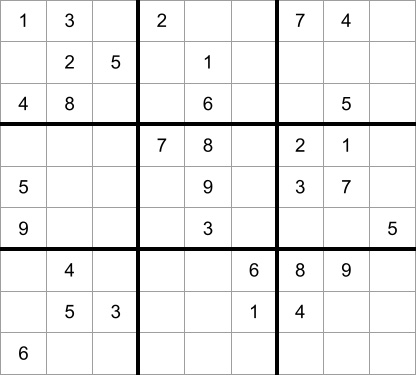

# sudokubox

[](https://github.com/yusufshakeel/sudokubox)
[](https://www.npmjs.com/package/sudokubox)
[](https://www.npmjs.com/package/sudokubox)

SudokuBox is an open source project that solves 9x9 sudoku puzzle.

## Table of content

* [Getting started](#getting-started)
  * [Install](#install)
  * [Require](#require)
  * [Solve](#solve)
  * [Is valid input](#is-valid-input)
  * [Is valid board](#is-valid-board)
  * [Generate](#generate)
  * [Config](#config)
    * [verbose](#verbose)
    * [logPerformance](#logperformance)
* [Sudoku board](#sudoku-board)
* [Input](#input)
* [Output](#output)
* [License](#license)

## Getting started

### Install

To install this run the following command in the terminal.

```shell
npm i sudokubox
```

### Require

Require `sudokubox`.

```javascript
const SudokuBox = require('sudokubox');
```

### Solve

Create object and pass input.

```javascript
const sudokuBox = new SudokuBox();

const input = [ /* this has 81 elements */ ];

const result = sudokuBox.solve({ input });
```

The `result` will have value like the following:

```
{ 
  "isPuzzleSolved": true,
  "isBoardValid": true,
  "output": [ /* this is a one dimensional array having 81 elements */ ], 
  "board": [ /* this is a two dimensional 9x9 array */ ]
}
```

If `isPuzzleSolved` is `false` then the puzzle was not solved.

If `isBoardValid` is `false` then the board is not valid and can't be solved.

#### Error

For error case the response will be like the following:

```
{
  "isPuzzleSolved": false,
  "error": {
    "message": "Some error message"
  }
}
```

### Is valid input

This is to check the validity of the one dimensional input array (having 81 elements).

```javascript
const sudokuBox = new SudokuBox();

const input = [ /* this has 81 elements */ ];

const result = sudokuBox.isValidInput({ input });
```

It will return `true` if input is valid.

#### Error

For error case the response will be like the following:

```
{
  "isValidInput": false,
  "error": {
    "message": "Some error message"
  }
}
```


Note!
* Input array can have empty cells (denoted by `0`).

Valid means if a number N appears in a given cell C(r,c) then
that number does not reappear in the

  * row (r)
  * column (c)
  * sub board SB(r,c)

### Is valid board

This is same as `isValidInput` but it checks the validity of the two dimensional array (9x9)
representing the board.

```javascript
const sudokuBox = new SudokuBox();

const board = [
  [/* 9 elements */],
  [/* 9 elements */],
  [/* 9 elements */],
  [/* 9 elements */],
  [/* 9 elements */],
  [/* 9 elements */],
  [/* 9 elements */],
  [/* 9 elements */],
  [/* 9 elements */],
];

const result = sudokuBox.isValidBoard({ board });
```

It will return `true` if board is valid.

#### Error

For error case the response will be like the following:

```
{
  "isValidBoard": false,
  "error": {
    "message": "Some error message"
  }
}
```

### Generate

Call `generate` with level to get a new puzzle.

```javascript
const sudokuBox = new SudokuBox();

const puzzleConfig = { /* some config */ };

const puzzle = sudokuBox.generate(puzzleConfig);
```

#### Puzzle Config

Following are the configurations to generate puzzles.

```javascript
{
  level: 'string'
}
```

For `level` set the following values.

```text
EASY
MEDIUM
HARD
EXTREME
```

### Config

To pass config to SudokuBox pass the config option.

```javascript
const config = { someConfigField: 'someConfigValue' };
const sudokuBox = new SudokuBox(config);
```

#### verbose

To print the logs pass the following config.

```javascript
const config = { verbose: true };
const sudokuBox = new SudokuBox(config);
```

Default: `verbose: false`

#### logPerformance

To print the performance pass the following config.

```javascript
const config = { logPerformance: true };
const sudokuBox = new SudokuBox(config);
```

When `logPerformance` is `true` then result will look like the following.

```
{ 
  "isPuzzleSolved": true,
  "isBoardValid": true,
  "output": [ /* this is a one dimensional array having 81 elements */ ], 
  "board": [ /* this is a two dimensional 9x9 array */ ],
  "performance": {
    "duration": {
      "nano": 24453670,
      "micro": 24453.67,
      "milli": 24.45367,
      "second": 0.02445367
    }
  }
}
```

Default: `logPerformance: false`

## Sudoku board

The board size is 9x9.

## Input

The input is a **one dimensional array** having 81 elements.

Use number `0` to denote empty cell.

Use number `1` to `9` to denote filled cell.

Following is a sample sudoku board.



Note! The array is formatted into lines for readability.

```javascript
[
  1, 3, 0, 2, 0, 0, 7, 4, 0,
  0, 2, 5, 0, 1, 0, 0, 0, 0,
  4, 8, 0, 0, 6, 0, 0, 5, 0,
  0, 0, 0, 7, 8, 0, 2, 1, 0,
  5, 0, 0, 0, 9, 0, 3, 7, 0,
  9, 0, 0, 0, 3, 0, 0, 0, 5,
  0, 4, 0, 0, 0, 6, 8, 9, 0,
  0, 5, 3, 0, 0, 1, 4, 0, 0,
  6, 0, 0, 0, 0, 0, 0, 0, 0
]
```

## Output

The output will be a **one dimensional array** having 81 elements.

For the above input array we will get the following output array.

Note! The array is formatted into lines for readability.

```javascript
[
  1, 3, 6, 2, 5, 9, 7, 4, 8,
  7, 2, 5, 4, 1, 8, 9, 3, 6,
  4, 8, 9, 3, 6, 7, 1, 5, 2,
  3, 6, 4, 7, 8, 5, 2, 1, 9,
  5, 1, 8, 6, 9, 2, 3, 7, 4,
  9, 7, 2, 1, 3, 4, 6, 8, 5,
  2, 4, 1, 5, 7, 6, 8, 9, 3,
  8, 5, 3, 9, 2, 1, 4, 6, 7,
  6, 9, 7, 8, 4, 3, 5, 2, 1
]
```

## License

It's free :smiley:

[MIT License](https://github.com/yusufshakeel/sudokubox/blob/master/LICENSE) Copyright (c) 2021 Yusuf Shakeel

### Donate

Feeling generous :smiley: [Donate via PayPal](https://www.paypal.me/yusufshakeel)